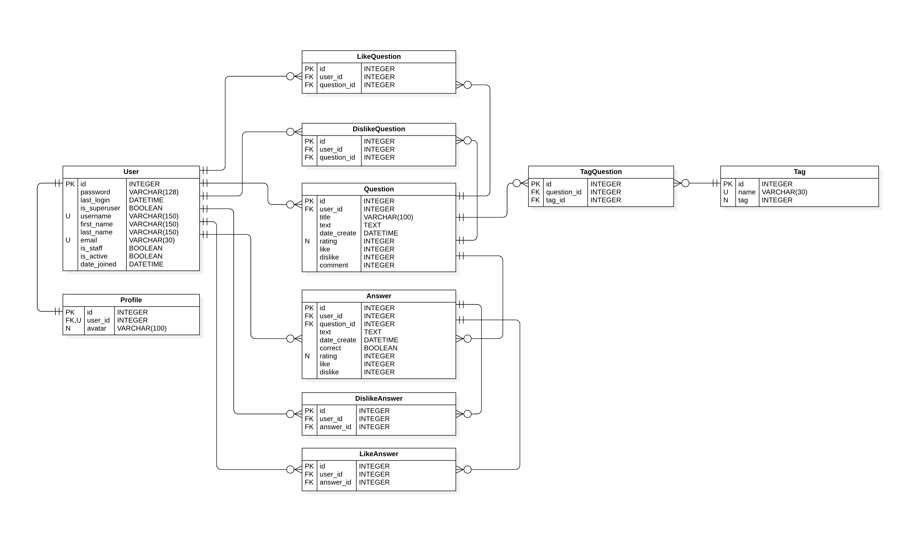
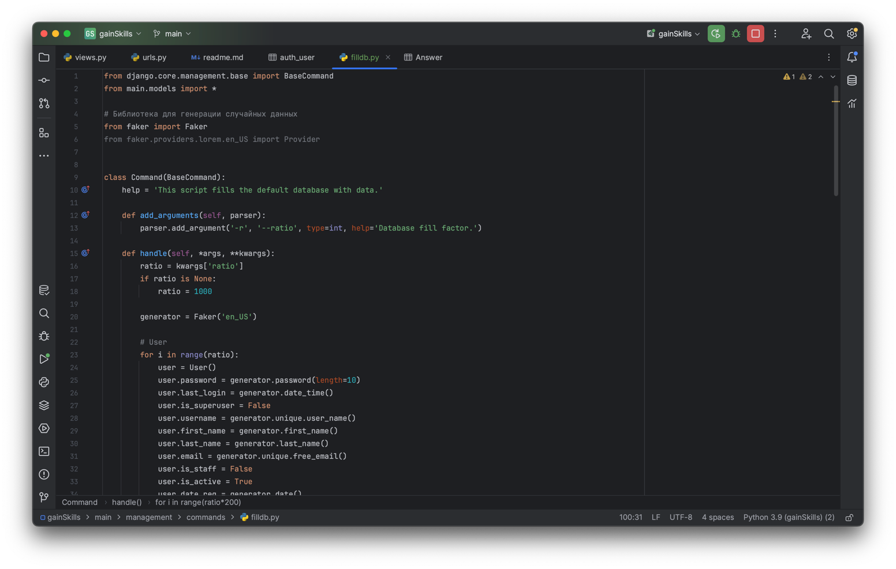
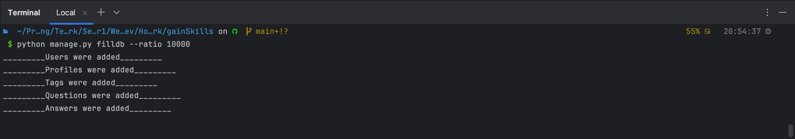

# Справочные данные 

## ER-диаграмма

На данный момент система построена так, что изменение рейтинга вопросов и ответов полностью ложится на плечи js.
Пользователь будет ставить лайк, на это событие будет вызываться обработчик js, который будет заносить изменения в
таблицы LikeQuestion и Question (будет менять рейтинг в соответствии с весом параметра). Аналогично с другими
сущностями.
Кол-во лайков и прочего будет считаться с помощью Django ORM.

## Заполнение БД данными
Для этого воспользуемся сторонней библиотекой Faker, которая позволяет генерировать псевдослучайный и уникальные данные
из различных сфер жизни. Также напишем Management Command, который можно будет запустить с помощью команды:  
  
`python manage.py filldb --ratio [число]` в квадратных скобках мы указываем коэффициент заполнения БД

Соответственно, после применения команды в базу должно быть добавлено:
+ пользователей — равное ratio;
+ вопросов — ratio * 10;
+ ответы — ratio * 100;
+ тэгов - ratio;
+ оценок пользователей - ratio * 200;

Чтобы уменьшить время выполнения скрипта, сперва создадим список объектов, а потом с помощью команды bulk_create() сразу
добавим все объекты в базу данных.

Время выполнения скрипта - 

